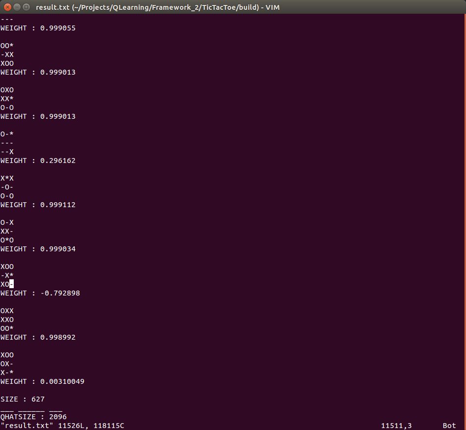

#FrameWork!
Q-Learning General Framework,
Implementing Q-Value function with cache table
as well as a general interface for State and Action classes.
Equipped with examples of Tic Tac Toe.

#Execution Image:

Confirmation : Assuming O starts first,
765(Total) - 91(O) - 44(X) - 3(draw) = **627** States
