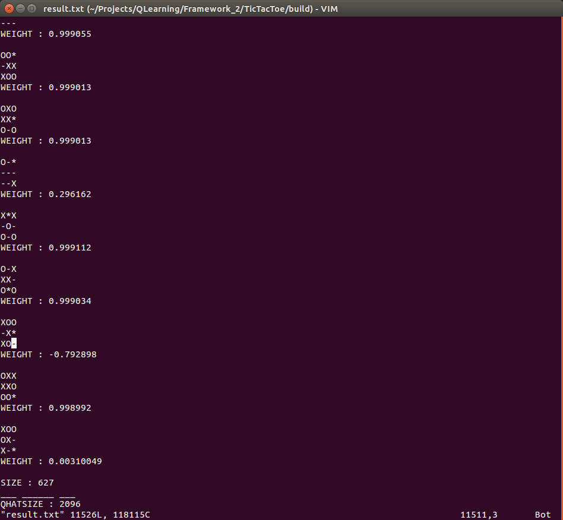

##TicTacToe
An implementation of Q-Learning Framework: Tic-Tac-Toe A.I.
Expanded to also include a variation of m,n,k-game in which m=n=k.

===

## NOTES
However, the number of possible states at m=4 is close to **[1135213](http://f2.org/maths/ttt.html)**;
It seems that caching would not be feasible. Instead, an artificial neural network
is anticipated to replace the current cache table.

For a general m,n,k-game, it seems that a convolutional neural network may also be of benefit,
since the configuration of the game is (somewhat) independent of translation.

===

#Sample Execution Image:

Confirmation : Assuming O starts first,
765(Total) - 91(O) - 44(X) - 3(draw) = **627** States
[Wikipedia](https://en.wikipedia.org/wiki/Tic-tac-toe)
